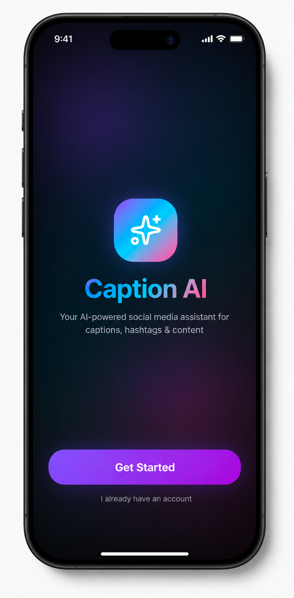
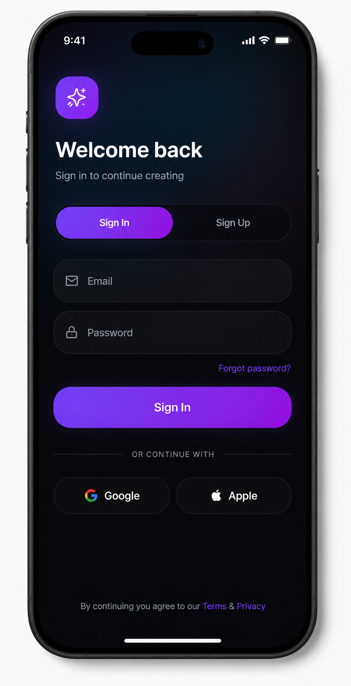
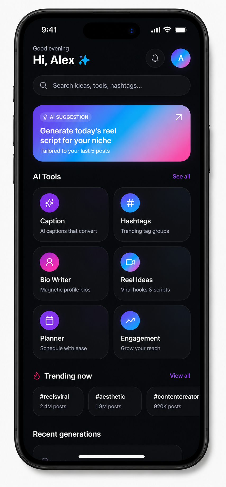
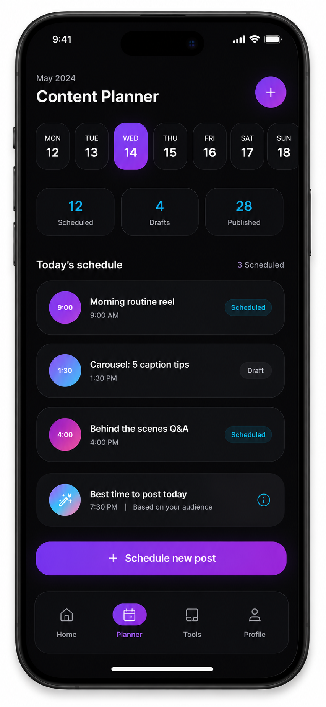

# Caption AI – Social Media Assistant

A production-ready Android application built with Clean Architecture, Multi-Module setup, and Gemini AI.

## Screenshots

<table align="center">
  <tr>
    <td align="center"><b>Splash Screen</b> </td>
    <td align="center"><b>Sign In / Sign Up</b> </td>
  </tr>
  <tr>
    <td align="center"><b>Dashboard</b> </td>
    <td align="center"><b>Calendar (Content Planner)</b> </td>
  </tr>
</table>

## Architecture
- **Clean Architecture**: separation of concerns into Presentation, Domain, and Data layers.
- **MVVM**: UI state management using StateFlow and ViewModels.
- **Multi-Module**: 14 Gradle modules for scalability and faster builds.
- **Dependency Injection**: Hilt for robust DI.
- **Local Persistence**: Room for saving captions, hashtags, and planner notes.
- **AI Integration**: Gemini AI (Google Generative AI SDK) for content generation.

## Modules
- `:app`: Main entry, Navigation Graph, Hilt App.
- `:core`: Utilities, ResultState, Constants.
- `:core-ui`: Design System, Material 3 Theme, Common Components.
- `:data`: Repository implementations, Mappers.
- `:domain`: Business models, Repository interfaces.
- `:feature-*`: Feature-specific UI and ViewModels.
- `:network`: Gemini API service, Retrofit configuration.
- `:database`: Room database setup, Entities, DAOs.
- `:firebase`: Firebase Auth and Firestore integration.

## Setup Instructions
1. **Gemini API Key**: Obtain an API key from [Google AI Studio](https://aistudio.google.com/).
2. **Configuration**: Open `network/src/main/kotlin/com/example/captionai/network/di/NetworkModule.kt` and replace `"YOUR_API_KEY"` with your actual key.
3. **Build**: Run `./gradlew assembleDebug` to build the application.
4. **Firebase**: To enable Firebase features, add your `google-services.json` to the `app/` directory.

## Features
- **Caption Generator**: Generate engaging captions with specific tones.
- **Hashtag Generator**: Get trending hashtags for any niche.
- **Bio Generator**: Create creative social media bios.
- **Content Planner**: Add and manage content ideas with Room persistence.
- **Dark Mode Support**: Fully compatible with Material 3 dynamic color and dark theme.
